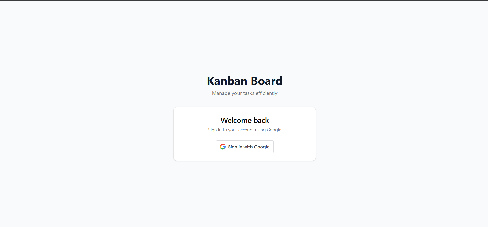
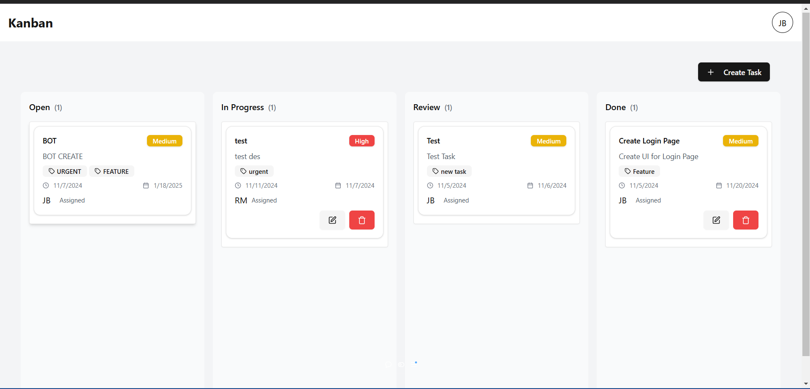

# Kanban Board

A kanban board project built with React, TypeScript, and Vite.

## Prerequisites

Before you begin, ensure you have the following installed:
- Node.js (LTS version recommended)
- npm (comes with Node.js)
- Git

## Project Setup

### 1. Clone the Repository

```bash
git clone [your-repository-url]
cd kanban-board
```

### 2. Environment Setup

1. Create a new `.env` file in the root directory:
   ```bash
   cp .env.example .env
   ```

2. Configure the environment variables:
   - Add your Google OAuth credentials (Client ID and Client Secret)
   - You can either:
     - Use your own Google Cloud Console credentials
     - Request the environment variables from the project maintainer

### 3. Install Dependencies

Install project dependencies using npm:
```bash
npm ci
```

> Note: We use `npm ci` instead of `npm install` to ensure consistent installations across all environments.

### 4. Run the Development Server

Start the development server:
```bash
npm run dev
```

The application will be available at [http://localhost:5173](http://localhost:5173)

## Screenshots

Here are some screenshots of the Kanban board. Click on the dropdown below to view them:

<details>
  <summary>Click to view Screenshot 1</summary>
  
</details>

<details>
  <summary>Click to view Screenshot 2</summary>
  
</details>

## Available Scripts

- `npm run dev` - Starts the development server
- `npm run build` - Creates a production build
- `npm run lint` - Runs ESLint to check code quality
- `npm run preview` - Previews the production build locally

## Tech Stack

- React 18
- TypeScript
- Vite
- Redux Toolkit
- React Router DOM
- Tailwind CSS
- Radix UI Components
- Hello Pangea DnD (Drag and Drop)
- Google OAuth
- Axios

## Development

- The project uses TypeScript for type safety
- ESLint is configured for code quality
- Tailwind CSS is used for styling
- State management is handled through Redux Toolkit
- Authentication is implemented using Google OAuth


## Additional Notes

- Make sure all environment variables are properly set before starting the application
- The project uses Vite as the build tool for faster development experience
- For any issues or questions, please open an issue in the repository